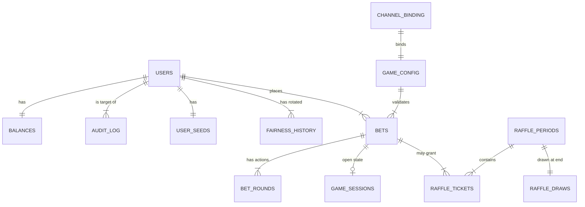
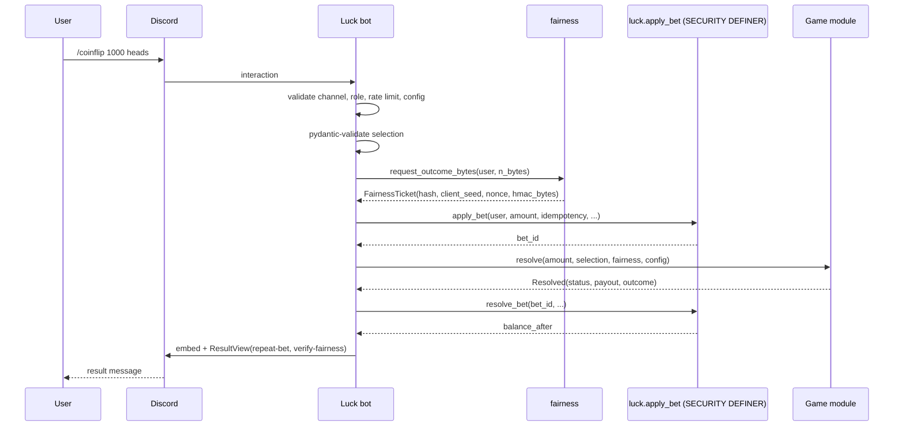

# DeathRoll Luck v1 — Design Specification

| Field | Value |
|---|---|
| **Document version** | 1.1 |
| **Date** | 2026-04-29 |
| **Author** | Aleix |
| **Repository** | <https://github.com/MaleSyrupOG/DeathRoll> |
| **Status** | Locked — all decisions including economics are final |
| **Supersedes** | v1.0 (2026-04-29 morning, before collaborator response) |

---

## 0. Executive summary

DeathRoll Luck is a Discord bot that runs a fully provably-fair casino on World of Warcraft Gold (denoted **G**). It is the first of three bots that together make up the DeathRoll platform, sharing a single PostgreSQL database:

- **DeathRoll Luck** (this spec) — the games bot.
- **DeathRoll Poker** — dedicated poker bot (future, separate spec).
- **DeathRoll Deposit/Withdraw** — handles all in-game gold movement; the only system component allowed to mint or destroy balance (future, separate spec).

Luck v1 ships with nine games, a monthly raffle, a per-user Provably Fair system based on HMAC-SHA512 with seed commit/reveal, an open-source verifier, a leaderboard, role-based admin commands, and fintech-grade security guarantees.

The design prioritises three properties, in order: **integrity** (no gold is ever created or destroyed by accident, no balance ever becomes negative), **verifiability** (every outcome can be recomputed by any user with the revealed seed), and **operational containment** (a compromise of the bot does not allow arbitrary money movement).

## 1. Goals and non-goals

### 1.1. Goals (v1)

1. Nine playable games: Coinflip, Dice, 99x, Hot/Cold, Mines, Blackjack, Roulette, Dice Duel, Staking Duel, plus the 5B Casino Raffle as a meta-feature. (Flower Poker is explicitly out of scope per collaborator decision 2026-04-29.)
2. Per-user Provably Fair using HMAC-SHA512 with seed commit/reveal, on-demand rotation, and a published verifier in both Node.js and Python.
3. PostgreSQL-backed shared persistence with strict per-bot DB roles and a SECURITY DEFINER economic boundary.
4. Append-only audit log with hash chain for tamper detection.
5. Role-based command visibility and access control (admin / user, with cashier reserved for the future D/W bot).
6. Per-channel command binding: one Discord channel per game, runtime-restricted.
7. Repeat Bet button with HMAC-signed `custom_id` and TTL.
8. Leaderboard with three categories × four time windows.
9. Container-level hardening: read-only filesystem, dropped capabilities, no-new-privileges, internal-only Postgres, dedicated Linux user.
10. Encrypted offsite-friendly backups, restore drill, runbook, and disaster-recovery plan.
11. Comprehensive automated tests (unit, integration, property-based, e2e) with strict coverage gates on critical modules.
12. Professional documentation in `docs/` covering architecture, security, operations, fairness, runbook, ADRs, and per-game technical sheets.

### 1.2. Non-goals (v1)

1. **Responsible gambling features** (self-exclusion, daily limits, anti-tilt cooldowns) — explicitly deferred per product decision; documented in `docs/responsible-gambling.md`.
2. **Bilingual UX** — v1 is English-only; internal documentation may be Spanish.
3. **Card splitting in Blackjack** — deferred to v1.1; double-down, insurance, BJ 3:2 included.
4. **Automated push-to-prod CI/CD** — manual deploy from VPS only in v1.
5. **Cross-server (multi-guild) deployment** — v1 is single-guild, command sync is per-guild.
6. **Mobile-first UI tweaks** — embeds are desktop-optimised.
7. **Wallet-to-wallet transfer between users via Luck** — minting/destroying gold belongs strictly to the D/W bot.

### 1.3. Success criteria

- All nine games playable end-to-end with a real Discord bot account against a real Postgres in the VPS.
- 100,000-bet simulation per game where empirical edge is within ±0.5 % of declared edge.
- Concurrency stress test: 100 simultaneous bets per user without ever leaving balance < 0 or double-credit.
- Independent verifier scripts reproduce 100 random outcomes byte-identical with the bot's stored data.
- Audit log immutability test passes (UPDATE/DELETE rejected; hash chain detects tampering).
- Restore drill restores a backup in < 30 minutes on a fresh VPS.

---

## 2. System architecture

### 2.1. Layered model

```
LAYER 3 — BOTS (Discord runtime, one Python process per bot)
  deathroll_luck     deathroll_poker     deathroll_deposit_withdraw
       │                  │                       │
       └──────────────────┴───────────────────────┘
                            │
LAYER 2 — CORE (shared business logic, framework-agnostic)
  deathroll_core/
    ├── balance/       wallets, transactions, locks
    ├── fairness/      provably fair (HMAC-SHA512)
    ├── audit/         append-only audit log
    ├── ratelimit/     per-user / per-game limits
    ├── config/        runtime game_config (DB-backed)
    ├── embeds/        shared Discord embed builders
    ├── security/      role checks, idempotency, button signing, validators
    └── models/        SQLAlchemy ORM models
                            │
LAYER 1 — INFRASTRUCTURE
  PostgreSQL 16   Docker network deathroll_net   /opt/deathroll/ filesystem
```

**Invariants of the layering:**

- `deathroll_core` does not import discord.py. Pure business logic. Testable without mocking Discord.
- Each bot is a separate process with its own Discord token and its own DB role.
- All bots share one Postgres database but operate in different schemas with role-restricted grants.

### 2.2. Monorepo layout

```
deathroll/
├── README.md
├── pyproject.toml                # workspace + ruff/mypy/black config
├── uv.lock                       # locked, hash-verified dependencies
├── .env.example                  # template, never with real secrets
├── .gitignore
├── Makefile                      # test, lint, run-dev, etc.
│
├── deathroll_core/
│   ├── balance/
│   ├── fairness/
│   ├── audit/
│   ├── ratelimit/
│   ├── config/
│   ├── embeds/
│   ├── security/
│   ├── models/
│   └── db.py
│
├── deathroll_luck/
│   ├── __main__.py
│   ├── client.py
│   ├── healthcheck.py
│   ├── games/
│   │   ├── _base.py
│   │   ├── coinflip.py
│   │   ├── dice.py
│   │   ├── ninetyninex.py
│   │   ├── hotcold.py
│   │   ├── mines.py
│   │   ├── diceduel.py
│   │   ├── stakingduel.py
│   │   ├── blackjack.py
│   │   └── roulette.py
│   ├── raffle/
│   ├── leaderboard/
│   ├── admin/
│   ├── account/
│   ├── fairness/
│   └── views/
│
├── deathroll_poker/                # placeholder for future bot
│   └── README.md
│
├── deathroll_deposit_withdraw/     # placeholder for future bot
│   └── README.md
│
├── ops/
│   ├── docker/
│   │   ├── compose.yml
│   │   ├── compose.prod.yml
│   │   ├── Dockerfile.luck
│   │   └── Dockerfile.core-base
│   ├── postgres/
│   │   └── init.sql
│   ├── alembic/
│   │   ├── env.py
│   │   └── versions/
│   ├── scripts/
│   │   ├── deploy.sh
│   │   ├── backup.sh
│   │   ├── restore.sh
│   │   └── audit_verify.py
│   └── observability/
│       └── grafana-dashboards/
│
├── docs/
│   ├── README.md
│   ├── architecture.md
│   ├── security.md
│   ├── provably-fair.md
│   ├── operations.md
│   ├── runbook.md
│   ├── backup-restore.md
│   ├── observability.md
│   ├── dr-plan.md
│   ├── release-process.md
│   ├── secrets-rotation.md
│   ├── responsible-gambling.md
│   ├── onboarding.md
│   ├── changelog.md
│   ├── adr/
│   ├── games/
│   ├── superpowers/specs/
│   ├── verifier/
│   └── api/
│
├── tests/
│   ├── conftest.py
│   ├── unit/
│   ├── integration/
│   ├── property/
│   └── e2e/
│
└── .github/
    └── workflows/
        └── ci.yml
```

**Package manager:** `uv` (modern, fast, hash-verifying lockfile).
**Spec location:** `docs/superpowers/specs/<date>-<topic>-design.md` (this document lives there).

---

## 3. Database design

### 3.1. Schemas and DB roles

One PostgreSQL 16 instance, one database (`deathroll`), four schemas, five DB roles.

| Schema | Purpose |
|---|---|
| `core` | shared identity and money: `users`, `balances`, `audit_log` |
| `fairness` | shared provably-fair seeds and history |
| `luck` | this bot only: `bets`, `bet_rounds`, `game_sessions`, `game_config`, `channel_binding`, `rate_limit_entries`, `raffle_*`, `leaderboard_snapshot` |
| `poker` | reserved for future bot |

(The Deposit/Withdraw bot does not need its own schema; it operates on `core` directly.)

| DB role | Login | Schema access |
|---|---|---|
| `deathroll_admin` | yes | OWNER on all schemas. Used only by Alembic migrations and operations. |
| `deathroll_luck` | yes | RW on `luck.*` and `fairness.*`; read-only on `core.users`/`core.balances`; INSERT-only on `core.audit_log`. **No UPDATE or DELETE on `core.balances`.** Money movement happens only through `SECURITY DEFINER` functions. |
| `deathroll_dw` | yes | RW on `core.users` and `core.balances`; INSERT on `core.audit_log`. The only role permitted to create users or alter balances outside of game settlement. |
| `deathroll_poker` | yes | symmetric to `deathroll_luck`, scoped to `poker.*` (future). |
| `deathroll_readonly` | yes | SELECT on all schemas. Used by Grafana, ad-hoc debugging via SSH tunnel. |

### 3.2. Entity-relationship diagram (high level)



### 3.3. Tables — definitive DDL

#### `core.users`

```sql
CREATE TABLE core.users (
    discord_id      BIGINT      PRIMARY KEY,
    created_at      TIMESTAMPTZ NOT NULL DEFAULT NOW(),
    updated_at      TIMESTAMPTZ NOT NULL DEFAULT NOW(),
    banned          BOOLEAN     NOT NULL DEFAULT FALSE,
    banned_reason   TEXT,
    banned_at       TIMESTAMPTZ
);
```

INSERT only by `deathroll_dw` on first deposit confirmation. Luck never creates users.

#### `core.balances`

```sql
CREATE TABLE core.balances (
    discord_id      BIGINT      PRIMARY KEY REFERENCES core.users(discord_id) ON DELETE RESTRICT,
    balance         BIGINT      NOT NULL DEFAULT 0 CHECK (balance >= 0),
    locked_balance  BIGINT      NOT NULL DEFAULT 0 CHECK (locked_balance >= 0),
    total_wagered   BIGINT      NOT NULL DEFAULT 0 CHECK (total_wagered >= 0),
    total_won       BIGINT      NOT NULL DEFAULT 0 CHECK (total_won >= 0),
    updated_at      TIMESTAMPTZ NOT NULL DEFAULT NOW(),
    version         BIGINT      NOT NULL DEFAULT 0
);
```

`balance` is the **liquid** balance. `locked_balance` reserves gold during in-flight multi-round games (Mines, Blackjack). `total_wagered` and `total_won` are denormalised aggregates kept in sync by the SECURITY DEFINER functions; they accelerate leaderboard queries without scanning `bets`.

#### `core.audit_log` (append-only, hash-chained)

```sql
CREATE TABLE core.audit_log (
    id              BIGSERIAL   PRIMARY KEY,
    ts              TIMESTAMPTZ NOT NULL DEFAULT NOW(),
    actor_type      TEXT        NOT NULL CHECK (actor_type IN ('user','admin','system','cashier','bot')),
    actor_id        BIGINT      NOT NULL,
    target_id       BIGINT      NOT NULL REFERENCES core.users(discord_id) ON DELETE RESTRICT,
    action          TEXT        NOT NULL,
    amount          BIGINT,
    balance_before  BIGINT      NOT NULL,
    balance_after   BIGINT      NOT NULL,
    reason          TEXT,
    ref_type        TEXT        NOT NULL,
    ref_id          TEXT,
    bot_name        TEXT        NOT NULL,
    metadata        JSONB       NOT NULL DEFAULT '{}'::jsonb,
    prev_hash       BYTEA,
    row_hash        BYTEA       NOT NULL
);

CREATE INDEX idx_audit_target_ts  ON core.audit_log (target_id, ts DESC);
CREATE INDEX idx_audit_action_ts  ON core.audit_log (action, ts DESC);
CREATE INDEX idx_audit_ref        ON core.audit_log (ref_type, ref_id);

CREATE OR REPLACE FUNCTION core.audit_log_immutable() RETURNS TRIGGER
LANGUAGE plpgsql AS $$
BEGIN
    RAISE EXCEPTION 'audit_log is append-only — UPDATE/DELETE forbidden';
END;
$$;
CREATE TRIGGER audit_log_no_update BEFORE UPDATE ON core.audit_log
    FOR EACH ROW EXECUTE FUNCTION core.audit_log_immutable();
CREATE TRIGGER audit_log_no_delete BEFORE DELETE ON core.audit_log
    FOR EACH ROW EXECUTE FUNCTION core.audit_log_immutable();
```

`row_hash` = SHA-256(`AUDIT_HASH_CHAIN_KEY` ‖ `prev_hash` ‖ canonical-JSON of row without `row_hash`).
The chain is computed inside the SECURITY DEFINER functions when each row is inserted. A separate offline script `ops/scripts/audit_verify.py` walks the chain and reports any inconsistency.

#### `fairness.user_seeds`

```sql
CREATE TABLE fairness.user_seeds (
    discord_id              BIGINT      PRIMARY KEY REFERENCES core.users(discord_id) ON DELETE RESTRICT,
    server_seed             BYTEA       NOT NULL,
    server_seed_hash        BYTEA       NOT NULL,
    client_seed             TEXT        NOT NULL,
    nonce                   BIGINT      NOT NULL DEFAULT 0,
    created_at              TIMESTAMPTZ NOT NULL DEFAULT NOW(),
    rotated_at              TIMESTAMPTZ NOT NULL DEFAULT NOW()
);
```

`server_seed` is sensitive. The `fairness/` package is the only module that reads it; it is never logged, displayed, or returned outside of the package.

#### `fairness.history` (append-only)

```sql
CREATE TABLE fairness.history (
    id                      BIGSERIAL   PRIMARY KEY,
    discord_id              BIGINT      NOT NULL REFERENCES core.users(discord_id),
    revealed_server_seed    BYTEA       NOT NULL,
    server_seed_hash        BYTEA       NOT NULL,
    client_seed             TEXT        NOT NULL,
    last_nonce              BIGINT      NOT NULL,
    started_at              TIMESTAMPTZ NOT NULL,
    rotated_at              TIMESTAMPTZ NOT NULL DEFAULT NOW(),
    rotated_by              TEXT        NOT NULL CHECK (rotated_by IN ('user','system','admin'))
);
CREATE INDEX idx_fairness_history_user ON fairness.history (discord_id, rotated_at DESC);
-- same append-only triggers as core.audit_log
```

#### `luck.game_config` (admin-tunable runtime)

```sql
CREATE TABLE luck.game_config (
    game_name           TEXT        PRIMARY KEY,
    enabled             BOOLEAN     NOT NULL DEFAULT TRUE,
    min_bet             BIGINT      NOT NULL CHECK (min_bet > 0),
    max_bet             BIGINT      NOT NULL CHECK (max_bet >= min_bet),
    house_edge_bps      INT         NOT NULL CHECK (house_edge_bps BETWEEN 0 AND 10000),
    payout_multiplier   NUMERIC(8,4),
    extra_config        JSONB       NOT NULL DEFAULT '{}'::jsonb,
    updated_at          TIMESTAMPTZ NOT NULL DEFAULT NOW(),
    updated_by          BIGINT      NOT NULL
);
```

House edge stored as integer basis points (`500` = 5 %) to avoid float imprecision. v1 sets `house_edge_bps = 500` for every game (uniform 5 % target).

`extra_config` JSONB carries game-specific knobs:

- **Parametric games** (Coinflip, Dice, 99x, Hot/Cold, Mines, Dice Duel, Staking Duel): the 5 % edge is baked into the payout calculation directly. `extra_config` may be empty or hold game-only knobs (e.g. Mines `{"max_mines":24,"min_mines":1,"default_mines":3,"grid_size":25}`).
- **Rule-based games** (Blackjack, Roulette): standard rules apply (BJ 3:2 / S17 / no insurance / split deferred to v1.1; Roulette European single-zero with standard payouts). To bring the total edge to the 5 % target, an upfront `commission_bps` is taken from each bet at `apply_bet`. `extra_config` carries this:
  - Blackjack: `{"commission_bps": 450, "rules": "vegas_s17_3to2_noins_nosplit", "decks": 6}`
  - Roulette: `{"commission_bps": 236, "variant": "european_single_zero"}`

A separate global setting `raffle_rake_bps = 100` (1 %) is taken from every bet on top of the house edge and routed to the active period's pool.

#### `luck.channel_binding`

```sql
CREATE TABLE luck.channel_binding (
    game_name       TEXT        PRIMARY KEY REFERENCES luck.game_config(game_name) ON UPDATE CASCADE,
    channel_id      BIGINT      NOT NULL UNIQUE,
    updated_at      TIMESTAMPTZ NOT NULL DEFAULT NOW(),
    updated_by      BIGINT      NOT NULL
);
```

#### `luck.bets`

```sql
CREATE TABLE luck.bets (
    id                  BIGSERIAL   PRIMARY KEY,
    bet_uid             TEXT        NOT NULL UNIQUE,
    discord_id          BIGINT      NOT NULL REFERENCES core.users(discord_id),
    game_name           TEXT        NOT NULL REFERENCES luck.game_config(game_name),
    channel_id          BIGINT      NOT NULL,
    bet_amount          BIGINT      NOT NULL CHECK (bet_amount > 0),
    selection           JSONB       NOT NULL,
    status              TEXT        NOT NULL CHECK (status IN ('open','resolved_win','resolved_loss','resolved_tie','refunded','voided')),
    payout_amount       BIGINT      NOT NULL DEFAULT 0 CHECK (payout_amount >= 0),
    profit              BIGINT,
    server_seed_hash    BYTEA       NOT NULL,
    client_seed         TEXT        NOT NULL,
    nonce               BIGINT      NOT NULL,
    outcome             JSONB,
    idempotency_key     TEXT        NOT NULL,
    placed_at           TIMESTAMPTZ NOT NULL DEFAULT NOW(),
    resolved_at         TIMESTAMPTZ,
    UNIQUE (discord_id, idempotency_key)
);

CREATE INDEX idx_bets_user_ts   ON luck.bets (discord_id, placed_at DESC);
CREATE INDEX idx_bets_game_ts   ON luck.bets (game_name, placed_at DESC);
CREATE INDEX idx_bets_status    ON luck.bets (status) WHERE status = 'open';
CREATE INDEX idx_bets_resolved  ON luck.bets (resolved_at DESC) WHERE status LIKE 'resolved%';
```

`(discord_id, idempotency_key)` UNIQUE is the **double-charge prevention**.

#### `luck.bet_rounds` (multi-round games)

```sql
CREATE TABLE luck.bet_rounds (
    id              BIGSERIAL   PRIMARY KEY,
    bet_id          BIGINT      NOT NULL REFERENCES luck.bets(id) ON DELETE RESTRICT,
    round_index     INT         NOT NULL,
    nonce           BIGINT      NOT NULL,
    action          TEXT        NOT NULL,
    action_data     JSONB       NOT NULL DEFAULT '{}'::jsonb,
    outcome         JSONB       NOT NULL,
    created_at      TIMESTAMPTZ NOT NULL DEFAULT NOW(),
    UNIQUE (bet_id, round_index)
);
```

#### `luck.game_sessions`

```sql
CREATE TABLE luck.game_sessions (
    bet_id          BIGINT      PRIMARY KEY REFERENCES luck.bets(id) ON DELETE RESTRICT,
    state           JSONB       NOT NULL,
    expires_at      TIMESTAMPTZ NOT NULL,
    updated_at      TIMESTAMPTZ NOT NULL DEFAULT NOW()
);
CREATE INDEX idx_session_expires ON luck.game_sessions (expires_at);
```

A background task auto-resolves orphan sessions past `expires_at` (10 min default; configurable per game in `extra_config`).

#### `luck.rate_limit_entries`

```sql
CREATE TABLE luck.rate_limit_entries (
    id              BIGSERIAL   PRIMARY KEY,
    discord_id      BIGINT      NOT NULL,
    scope           TEXT        NOT NULL,
    bucket_start    TIMESTAMPTZ NOT NULL,
    count           INT         NOT NULL DEFAULT 1,
    UNIQUE (discord_id, scope, bucket_start)
);
CREATE INDEX idx_ratelimit_lookup ON luck.rate_limit_entries (discord_id, scope, bucket_start DESC);
```

Sliding-window counter; old buckets purged hourly.

#### Raffle tables

```sql
CREATE TABLE luck.raffle_periods (
    id              BIGSERIAL   PRIMARY KEY,
    period_label    TEXT        NOT NULL UNIQUE,
    starts_at       TIMESTAMPTZ NOT NULL,
    ends_at         TIMESTAMPTZ NOT NULL CHECK (ends_at > starts_at),
    pool_amount     BIGINT      NOT NULL DEFAULT 0 CHECK (pool_amount >= 0),
    status          TEXT        NOT NULL CHECK (status IN ('active','drawing','closed')),
    created_at      TIMESTAMPTZ NOT NULL DEFAULT NOW()
);

CREATE TABLE luck.raffle_tickets (
    id              BIGSERIAL   PRIMARY KEY,
    period_id       BIGINT      NOT NULL REFERENCES luck.raffle_periods(id),
    discord_id      BIGINT      NOT NULL REFERENCES core.users(discord_id),
    bet_id          BIGINT      REFERENCES luck.bets(id),
    granted_at      TIMESTAMPTZ NOT NULL DEFAULT NOW()
);
CREATE INDEX idx_tickets_period_user ON luck.raffle_tickets (period_id, discord_id);
CREATE INDEX idx_tickets_period_ts   ON luck.raffle_tickets (period_id, granted_at DESC);

CREATE TABLE luck.raffle_draws (
    id                      BIGSERIAL   PRIMARY KEY,
    period_id               BIGINT      NOT NULL UNIQUE REFERENCES luck.raffle_periods(id),
    drawn_at                TIMESTAMPTZ NOT NULL DEFAULT NOW(),
    pool_amount             BIGINT      NOT NULL,
    revealed_server_seed    BYTEA       NOT NULL,
    server_seed_hash        BYTEA       NOT NULL,
    client_seed_used        TEXT        NOT NULL,
    nonces_used             JSONB       NOT NULL,
    winners                 JSONB       NOT NULL,
    total_tickets           BIGINT      NOT NULL
);
-- append-only trigger
```

#### `luck.leaderboard_snapshot`

```sql
CREATE TABLE luck.leaderboard_snapshot (
    period          TEXT        NOT NULL CHECK (period IN ('daily','weekly','monthly','all_time')),
    category        TEXT        NOT NULL CHECK (category IN ('top_wagered','top_won','top_big_wins')),
    snapshot        JSONB       NOT NULL,
    computed_at     TIMESTAMPTZ NOT NULL DEFAULT NOW(),
    PRIMARY KEY (period, category)
);
```

### 3.4. Stored procedures (the economic boundary)

Every money movement passes through a `SECURITY DEFINER` function owned by `deathroll_admin`. The bot's DB role only has `EXECUTE` on these functions, not `UPDATE` or `DELETE` on `core.balances`.

Functions:

- `luck.apply_bet(...)` — locks balance row, validates funds, deducts bet, inserts into `luck.bets`, writes `audit_log` entry. Idempotent on `(discord_id, idempotency_key)`.
- `luck.resolve_bet(bet_id, status, payout, profit, outcome_jsonb)` — releases lock, credits payout if win, updates aggregates, writes `audit_log`.
- `luck.refund_bet(bet_id, reason)` — return locked stake, updates audit.
- `luck.cashout_mines(bet_id, multiplier)` — special handling for mines mid-game cashout.
- `luck.consume_rate_token(discord_id, scope, window_s, max_count)` — atomic increment and check.
- `fairness.rotate_user_seed(discord_id, rotated_by)` — moves current seed to history, generates new one, resets nonce.
- `fairness.next_nonce(discord_id)` — atomic increment of nonce returning the value used; called by every game.

After migrations:

```sql
REVOKE ALL ON FUNCTION luck.apply_bet(...) FROM PUBLIC;
GRANT EXECUTE ON FUNCTION luck.apply_bet(...) TO deathroll_luck;
-- analogous for every economic function
```

A SQL injection on the bot cannot escalate to arbitrary `UPDATE core.balances` because that grant simply does not exist for the bot's role.

### 3.5. Migrations

Alembic with one shared history at `ops/alembic/versions/`. Migration files prefixed by schema area: `core_*`, `fairness_*`, `luck_*`. Every migration provides a working `downgrade()`. Migrations run as `deathroll_admin`, not as the bot.

### 3.6. Backups and retention

- Daily `pg_dump -Fc`, GPG-encrypted, written to `/opt/deathroll/backups/`.
- 30 daily backups + 12 monthly backups retained.
- Optional offsite mirror via `rsync` to a Hetzner Storage Box (recommended; ~3 €/month for 1 TB).
- GPG public-key fingerprint also stored outside the VPS (1Password / hardware token) so backups remain decryptable if the VPS dies.
- Restore drill executed quarterly into a temporary database.

---

## 4. Provably Fair design

### 4.1. Algorithm

Each user has a private state `(server_seed, client_seed, nonce)`:

- `server_seed`: 32 random bytes from `secrets.token_bytes(32)` (CSPRNG). Secret until rotation.
- `server_seed_hash`: `SHA-256(server_seed)` — the public commit.
- `client_seed`: user-controlled string, default to a random 16-character hex on first registration.
- `nonce`: monotonically increasing integer per game.

For every game roll:

```
out = HMAC-SHA512(key=server_seed, message=f"{client_seed}:{nonce}")  # 64 bytes
```

The first N bytes of `out` are sliced and decoded according to the game (see §4.4).

### 4.2. Lifecycle

```
First time the user plays:
  generate server_seed (CSPRNG)
  store (server_seed, sha256(server_seed), client_seed=random_hex(16), nonce=0)
  embed shows server_seed_hash, client_seed, nonce  (server_seed never shown)

User plays N games:
  nonce advances 0,1,...,N-1
  every bet records (server_seed_hash, client_seed, nonce_used) in luck.bets

User runs /myseed:
  shows current (server_seed_hash, client_seed, nonce)

User runs /setseed <new_client_seed>:
  updates client_seed; nonce continues; server_seed unchanged

User runs /rotateseed:
  fairness.rotate_user_seed():
    insert old (server_seed, hash, client_seed, last_nonce) into fairness.history
    generate new server_seed
    set nonce=0
  embed shows revealed previous server_seed and new committed hash
```

### 4.3. Operational rules

- `server_seed` raw never appears in logs, embeds, error messages, or any code path outside `deathroll_core/fairness/`.
- A unit test asserts `repr()` and `json.dumps()` of `UserSeed` redacts the raw seed.
- A lint-style `ruff` rule prohibits expressions of the form `log.X(... server_seed ...)`.
- An `/admin force-rotate-seed` and `/admin force-rotate-all` command exist for incident response.

### 4.4. Per-game decoding and payouts

All games target a uniform **5 % house edge**. Parametric games encode this in the payout multiplier directly; rule-based games (Blackjack, Roulette) apply an upfront `commission_bps` (see §3.3) plus standard rules.

| Game | Bytes | Decoding | Payout (5 % edge) |
|---|---|---|---|
| Coinflip | 1 | `heads` if `out[0] & 1 == 0` else `tails` | **1.90x** on win |
| Dice | 4 | `n = int.from_bytes(out[:4],'big'); roll = (n % 10000)/100` → `0.00–99.99` | dynamic: `(100 / win_size) × 0.95` |
| 99x | 1 | `(out[0] % 100) + 1` → `1–100` | **95x** on win (1/100 chance) |
| Hot/Cold | 2 | `n = int.from_bytes(out[:2],'big') % 10000`; `n < 500 = Rainbow`, `n < 5250 = Hot`, else `Cold` | Hot/Cold **1.90x**; Rainbow **14.25x** |
| Roulette (EU) | 2 | `int.from_bytes(out[:2],'big') % 37` → `0–36` | standard payouts (35x straight, 17x split, 8x corner, 2x outside, etc.) + 2.36 % upfront commission |
| Mines | ≤ 30 | Fisher-Yates shuffle of `[0..24]`; first N positions are mines | combinatorial multiplier **× 0.95** at cash-out |
| Blackjack | ≤ 60 | Fisher-Yates shuffle of full deck (six decks default, configurable in `extra_config.decks`); cards consumed from the top | standard Vegas: 1x even-money, 1.5x BJ; + 4.5 % upfront commission; no insurance, no split (deferred v1.1) |
| Dice Duel | 2 | `out[0] % 12 + 1` (player), `out[1] % 12 + 1` (bot) | **1.90x** on win; tie → automatic re-roll using next nonce |
| Staking Duel | varies | iterative HP/damage rolls per round; pre-computed once per bet | **1.90x** on win; tie → re-roll |
| Raffle (draw) | varies | Fisher-Yates of ticket array; first 3 entries are 1st/2nd/3rd | 50 / 30 / 20 % of pool |

For Mines, Blackjack, Staking Duel, and the Raffle, **all randomness is pre-computed at the start of the bet using one nonce**, then consumed deterministically. This minimises nonce usage and simplifies user-side verification.

### 4.5. Public verifier

`docs/verifier/` contains:

- `verify.js` — pure Node.js, no dependencies, ~150 LoC.
- `verify.py` — pure Python, no dependencies, ~150 LoC.
- `EXAMPLES.md` — step-by-step worked examples for every game.
- `test_vectors.json` — 100 known triples `(server_seed, client_seed, nonce, game) → expected_outcome` used by both the bot's CI and the verifier's CI.

CI runs both verifiers against the same vectors and against 1,000 random vectors and asserts they match the bot's `deathroll_core/fairness/` decoding byte-for-byte.

### 4.6. Game module contract

Every game implements the abstract base class `deathroll_luck.games._base.Game`:

```python
class Game(ABC):
    name: ClassVar[str]
    channel_key: ClassVar[str]
    is_multiround: ClassVar[bool] = False
    selection_model: ClassVar[type[Selection]]
    outcome_model: ClassVar[type[Outcome]]

    @abstractmethod
    def required_bytes(self, selection: Selection, config: GameConfig) -> int: ...

    @abstractmethod
    async def resolve(
        self, bet_amount: int, selection: Selection,
        fairness: FairnessTicket, config: GameConfig,
    ) -> Resolved: ...

    @abstractmethod
    def render_result_embed(self, bet: Bet, resolved: Resolved) -> discord.Embed: ...

    @abstractmethod
    def render_history_block(self, recent: list[Outcome]) -> str: ...
```

Multi-round games extend `MultiRoundGame` adding `initial_state`, `apply_action`, `can_cashout`, `cashout`.

Adding a new game = single file in `deathroll_luck/games/` + registration in `__init__.py` + a row in `luck.game_config`. No core changes.

---

## 5. Security model

### 5.1. The twelve pillars

Detailed in `docs/security.md`; summarised here.

1. **Secrets management** — `.env` mode 600 owned by `deathroll:deathroll`, env-injected into containers, never logged.
2. **DB transactions** — every money operation uses `SELECT … FOR UPDATE` row locks and runs inside `SECURITY DEFINER` functions; balance has a `CHECK (balance >= 0)` constraint.
3. **Provably Fair** — HMAC-SHA512 with strict commit/reveal cycle; revealed seeds preserved in append-only history.
4. **Anti-abuse** — per-user, per-game rate limits; max bet caps; admin-tunable.
5. **Identity & authorisation** — Discord interaction signature verified by the library; admin commands gated by `@require_role` decorator and Discord-side `default_member_permissions`.
6. **Audit log** — append-only enforced by triggers; hash chain detects tampering.
7. **Container hardening** — read-only root filesystem, dropped capabilities, no-new-privileges, pids/memory limits, healthchecks, non-root user inside.
8. **Dependency hygiene** — `uv.lock` hash-verified, `pip-audit` in CI, `mypy --strict`, `ruff`.
9. **Code rules** — no `eval`/`exec`/insecure deserialisation of user data; pydantic input validation; no f-string SQL.
10. **Backups & recovery** — daily encrypted backups, 30-day retention, drill quarterly.
11. **Monitoring** — Prometheus metrics, Grafana dashboards, Alertmanager alerts on critical conditions.
12. **Discord transport** — TLS only (default in discord.py); slash commands and gateway only, no message-content intent.

### 5.2. Idempotency pattern

```python
def generate_idempotency_key(interaction: discord.Interaction) -> str:
    return f"discord:{interaction.id}"

# for Repeat-Bet button (signed custom_id includes original bet uid + click ts)
def generate_repeat_idempotency_key(original_bet_uid, click_ts, user_id) -> str:
    return f"repeat:{original_bet_uid}:{click_ts}:{user_id}"
```

Postgres enforces `UNIQUE (discord_id, idempotency_key)` on `luck.bets`. The `apply_bet` function detects conflict and either returns the existing bet (benign retry) or raises a normalised exception.

### 5.3. Button signing

Buttons (`Repeat Bet`, `Cash Out`, `Hit`, `Stand`, `Reveal tile`, …) carry a signed `custom_id`:

```
custom_id = "v1." + base64url(JSON(payload + exp)) + "." + base64url(HMAC-SHA256(payload + exp, KEY))
```

Verification rejects expired or tampered IDs; payload includes `user_id` and the handler asserts `payload.user_id == interaction.user.id` so a malicious user cannot trigger another user's button. TTL: 10 minutes.

### 5.4. Channel restriction

A `@require_channel(game_name)` decorator checks `interaction.channel_id` against `luck.channel_binding` (cached in memory, refreshed every 60 s). Non-matching channel → ephemeral embed redirecting to the correct channel.

### 5.5. Role-based command visibility

Three layers, all enforced:

1. **Discord registration:** admin commands declared with `@app_commands.default_permissions()` (= `Permissions(0)`) so they are hidden from autocomplete by default.
2. **Discord integration UI:** the server owner enables the admin commands for the `@admin` role under *Server Settings → Integrations → DeathRoll Luck*. One-time setup, documented in `docs/operations.md`.
3. **Runtime decorator:** every admin command runs through `@require_role("admin")`; failed authorisation attempts are written to `audit_log`.

User-facing commands (`/coinflip`, etc.) carry no `default_member_permissions`, so they are visible to everyone.

In Luck v1 there are no cashier-only commands; the same three-layer pattern is reserved for the future Deposit/Withdraw bot.

### 5.6. Threat model summary

| Threat | Vector | Primary mitigation | Secondary |
|---|---|---|---|
| Double charge | Network retry / double click | UNIQUE idempotency_key | audit log review |
| Negative balance | Race / bug | CHECK + SELECT FOR UPDATE | concurrency CI test |
| Manipulated fairness | Casino edits seeds in DB | hash committed + public verifier | audit log hash chain |
| Secret leak | Accidental log | redaction processor + lint + test | force-rotate command |
| SQL injection | Malformed input | parameterised queries | pydantic validation |
| RCE in bot | Compromised dep | pip-audit + read-only image + cap_drop | SECURITY DEFINER boundary |
| Auth bypass | Admin cmd without role | `@require_role` decorator | audit log + alerts |
| Replay | Same interaction twice | discord.py signature + idempotency | rate limit |
| Postgres credential stuffing | Weak password | random 40-char password + not exposed | network isolation |
| Command spam | Abusive user | rate-limit table | ban via D/W bot |
| Audit-log tampering | Compromised root | hash chain detection + offsite backups | periodic `audit_verify.py` |
| Stolen backup | Storage compromise | GPG-encrypted | key fingerprint stored elsewhere |

---

## 6. Discord layer

### 6.1. Slash command catalogue

#### Game commands (per-channel restriction enforced)

| Command | Channel | Args |
|---|---|---|
| `/coinflip` | `#coinflip` | `bet:int`, `side:heads/tails` |
| `/dice` | `#dice` | `bet:int`, `direction:over/under`, `threshold:int` |
| `/99x` | `#99x` | `bet:int`, `number:int` |
| `/hotcold` | `#hot-n-cold` | `bet:int`, `pick:hot/cold/rainbow` |
| `/mines` | `#mines` | `bet:int`, `mines_count:int` |
| `/blackjack` | `#blackjack` | `bet:int` |
| `/roulette` | `#roulette` | `bet:int`, `selection:str` |
| `/diceduel` | `#dice-duel` | `bet:int` |
| `/staking` | `#staking` | `bet:int`, `rounds:int` |
| `/raffleinfo` | `#5b-casino-raffle` | — |
| `/raffletickets` | `#5b-casino-raffle` | — |

#### Account commands (any channel)

| Command | Args |
|---|---|
| `/balance` | — |
| `/myseed` | — |
| `/setseed` | `client_seed:str` |
| `/rotateseed` | — (modal confirm) |
| `/history` | `game?:str`, `limit?:int` |
| `/help` | `topic?:str` |
| `/fairness` | — |

#### Admin commands (hidden by default; enabled by server owner per role)

| Command | Args |
|---|---|
| `/admin set-bet-limits` | `game:str`, `min:int`, `max:int` |
| `/admin set-house-edge` | `game:str`, `bps:int` |
| `/admin pause-game` | `game:str` |
| `/admin resume-game` | `game:str` |
| `/admin pause-all` | — (modal confirm) |
| `/admin resume-all` | — |
| `/admin force-rotate-seed` | `user:User` |
| `/admin force-rotate-all` | — (modal confirm) |
| `/admin view-config` | — |
| `/admin view-audit` | `user?:User`, `limit:int` |
| `/admin force-close-game` | `bet_uid:str` |
| `/admin set-channel` | `game:str`, `channel:Channel` |
| `/admin set-rate-limit` | `scope:str`, `value:int` |

### 6.2. Interaction lifecycle (typical bet)



### 6.3. Embed system

Colour palette (from `deathroll-design-system.html`):

| Token | Hex | Use |
|---|---|---|
| INK | `#06060B` | base background reference |
| GOLD | `#F2B22A` | neutral / informational |
| WIN | `#5DBE5A` | bet won |
| BUST | `#D8231A` | bet lost |
| EMBER | `#C8511C` | warnings (wrong channel, paused) |
| HOUSE | `#5B7CC9` | system / house badge |
| JACKPOT | `#FFD800` | rare big-win highlight |

Shared embed builders live in `deathroll_core/embeds/`:

- `result_embed(bet, resolved, last_outcomes, game_emoji, image?)` — the canonical game-result embed.
- `no_balance_embed`, `insufficient_balance_embed`, `rate_limited_embed`, `game_paused_embed`, `wrong_channel_embed`, `error_embed`, `bet_expired_embed`, `welcome_fairness_embed`, `welcome_game_embed`.

Every embed includes a Provably Fair footer with `server_seed_hash` (truncated), `client_seed`, `nonce`, and `bet_uid`.

### 6.4. Multi-round UX

- **Mines** — 5×5 grid of buttons (closed = `❓`, revealed = `💎`, mine on resolve = `💣`) plus a centred *Cash Out* button showing the live multiplier. All randomness pre-computed at `apply_bet`. Session expires after 10 min of inactivity → automatic cashout at current multiplier.
- **Blackjack** — buttons `Hit` / `Stand` / `Double` (split deferred to v1.1). Deck pre-shuffled at `apply_bet`. Cards rendered as a PNG via Pillow over pre-rendered card assets in `deathroll_luck/assets/cards/`. Session expires after 5 min → auto-stand.
- **Staking Duel** — non-interactive; the bot animates rounds by editing the embed every ~1.5 s. All HP/damage rolls pre-computed.

### 6.5. Bot startup

```python
async def main():
    settings = Settings()
    setup_logging(settings.log_level, settings.log_format == "json")
    bot = build_bot(settings)

    @bot.event
    async def on_ready():
        log.info("ready", user_id=bot.user.id)
        if settings.guild_id:
            await bot.tree.sync(guild=discord.Object(id=settings.guild_id))

    async with bot:
        await bot.start(settings.discord_token.get_secret_value())
```

Per-guild sync (instant) in v1; switching to global sync if the bot expands to multiple servers.

### 6.6. Welcome embeds

On startup the bot ensures pinned welcome embeds exist in `#fairness` and in every game channel. If they exist (re-deploy), they are not duplicated. Content describes rules, payout, edge, min/max bet, and Provably Fair info.

---

## 7. Deployment and operations

### 7.1. VPS environment

- Host: Hetzner VPS aliased `sdr-agentic`, Ubuntu, 8 vCPU, 15 GiB RAM, 301 GiB disk.
- Existing Docker projects (sdr-agentic, infinityboostapp, keystoneforge, oblivion-demo, reverse-proxy) remain untouched. DeathRoll is fully isolated.

### 7.2. One-time setup (run as root via SSH)

1. Create dedicated user `deathroll` with home `/opt/deathroll` and group membership in `docker`.
2. Create `/opt/deathroll/{repo,secrets,backups,logs,scripts}` with perms 750/700.
3. Clone the public repo into `/opt/deathroll/repo`.
4. Generate strong random secrets into `/opt/deathroll/secrets/.env.shared` (PG passwords, `BUTTON_SIGNING_KEY`, `AUDIT_HASH_CHAIN_KEY`).
5. Manually edit `/opt/deathroll/secrets/.env.luck` to insert the Discord token and `GUILD_ID`.
6. Generate a GPG key pair on the VPS for backup encryption; record fingerprint outside the VPS.
7. Confirm UFW/iptables rules unchanged.

Detailed shell commands are in `docs/operations.md`.

### 7.3. Docker stack

`ops/docker/compose.yml` defines two services:

- `deathroll-postgres` — `postgres:16-alpine`, internal-only, healthcheck, hardened capabilities, init.sql mounts schemas/roles/grants on first run.
- `deathroll-luck` — read-only root FS, tmpfs `/tmp`, `cap_drop: ALL`, `no-new-privileges`, `pids_limit: 256`, `mem_limit: 512m`, runs as UID 1001, depends on Postgres healthy.

Network `deathroll_net` is a dedicated bridge with subnet `172.30.0.0/24`. No host port bindings on either service. Outbound to Discord works via the default bridge route.

### 7.4. Initial deployment

1. `docker compose up -d --build` from `/opt/deathroll/repo`.
2. Wait for `deathroll-postgres` healthy.
3. Run `alembic upgrade head` inside the bot container to create tables, triggers, SECURITY DEFINER functions.
4. Seed `luck.game_config` with default values.
5. Seed `luck.channel_binding` from a JSON file containing the channel IDs.
6. Verify the bot is online in Discord.
7. In Discord: configure command visibility for the `@admin` role (one-time step in *Server Settings → Integrations*).

### 7.5. Subsequent deployments

- **Hot reload** (text/embed changes only): `git pull && docker compose up -d --build deathroll-luck`. Downtime ~5 s.
- **Schema migration**: backup → preview migration with `alembic upgrade head --sql` → stop bot → run migration → start new bot. Downtime up to 2 min.
- **Rollback**: `git checkout <previous-sha> && docker compose up -d --build`; if migration must roll back, `alembic downgrade -1`; if data is incompatible, restore from backup.

CI/CD is GitHub Actions for **lint, type, test, audit, coverage** only. Deploy is **manual from VPS** in v1.

### 7.6. Backup and restore

- `ops/scripts/backup.sh` runs at 03:00 UTC daily via `/etc/cron.d/deathroll-backup` (root cron). Output: encrypted dump in `/opt/deathroll/backups/daily/`. On the 1st of each month, also copied to `monthly/`. Retention: 30 daily + 12 monthly.
- Optional `rsync` to a Hetzner Storage Box if SSH key is configured.
- Restore procedure documented in `docs/backup-restore.md`. Drill quarterly.

### 7.7. Observability

- Logs: container json-file driver → ingested by the existing `sdr-agentic-promtail` → Loki.
- Metrics: bot exposes Prometheus `/metrics` on port 9100 inside `deathroll_net`. Existing Prometheus scrapes from `deathroll-luck:9100` after adding the network to its config.
- Dashboards: `ops/observability/grafana-dashboards/deathroll-luck.json` — bets per minute, total volume, balances histogram, error rate, fairness rotations, restart events, DB stats.
- Alertmanager rules: bot down, Postgres down, balance-negative attempts (CHECK rejections), high error rate, unusual wager rate. Notifications to a staff `#alerts` Discord webhook.

### 7.8. Disaster recovery

| Disaster | RTO | RPO |
|---|---|---|
| Bot crash | < 1 min (auto-restart) | 0 |
| Postgres corruption | < 30 min | 24 h |
| VPS lost | < 4 h | 24 h |
| GPG key lost | unrecoverable — fingerprint stored outside the VPS to detect this and enable rebuilding |

DR drill semi-annually on a fresh VPS.

---

## 8. Testing strategy

### 8.1. Test pyramid

- ~400+ **unit tests** — game maths, fairness decoding, validators, embed builders. Fast, in-memory, run on every save.
- ~80 **integration tests** — DB transactions, locks, SECURITY DEFINER permissions, audit-log triggers. Use `testcontainers` to spin up an ephemeral Postgres.
- ~30 **property-based tests** — `hypothesis`-driven invariants: balance never < 0 across random sequences, fairness decodes always in valid range, etc.
- ~10 **e2e tests** — against a Discord sandbox server, run weekly (not on every PR).

### 8.2. Coverage gates

| Module | Minimum |
|---|---|
| `deathroll_core/balance/` | 95 % |
| `deathroll_core/fairness/` | 95 % |
| `deathroll_core/audit/` | 95 % |
| `deathroll_core/security/` | 90 % |
| `deathroll_luck/games/*` | 90 % |
| `deathroll_luck/admin/` | 85 % |
| Global | 85 % |

Enforced in CI; PR that drops a critical module below threshold fails.

### 8.3. Critical test categories (selected examples)

- **Concurrent bets**: 100 parallel bets per user; final balance is exact, never negative.
- **Idempotency**: the same key returns the same bet; different keys create separate bets.
- **Permission boundary**: connect as `deathroll_luck` and try `UPDATE core.balances` directly → Postgres rejects.
- **Fairness vectors**: 100 hand-crafted `(server_seed, client_seed, nonce) → expected_outcome` triples; both `verify.py` and `verify.js` produce identical results to the bot.
- **Server seed redaction**: `repr(seeds)`, `json.dumps(seeds)` cannot leak the raw seed; lint rule blocks logging it.
- **Audit-log immutability**: `UPDATE`/`DELETE` raise; hash chain breaks if a row is altered out-of-band; `audit_verify.py` detects it.
- **Channel restriction**: command in wrong channel returns ephemeral redirect.
- **Admin auth**: non-admin user invoking `/admin set-bet-limits` is denied and the attempt is audited.
- **Per-game empirical edge**: 100,000 simulated games per game; observed edge within ±0.5 % of declared.

### 8.4. CI pipeline

`.github/workflows/ci.yml` on every PR:

1. `ruff check` + `ruff format --check`
2. `mypy --strict deathroll_core deathroll_luck`
3. `pip-audit --strict`
4. `pytest tests/unit`
5. `pytest tests/integration` (with Postgres service container)
6. `pytest tests/property`
7. Coverage gates per module + global
8. Cross-implementation verifier check (`verify.py` vs `verify.js`)

Weekly cron job runs e2e tests against the Discord sandbox.

---

## 9. Documentation deliverables

`docs/` becomes the project's nervous system. Final structure:

```
docs/
├── README.md                       # master index
├── architecture.md                 # this spec, polished and split
├── security.md                     # 12 pillars + threat model
├── provably-fair.md                # user-facing PF explainer
├── operations.md                   # deploy / setup procedures
├── runbook.md                      # incident playbook
├── backup-restore.md
├── observability.md
├── dr-plan.md
├── release-process.md
├── secrets-rotation.md
├── responsible-gambling.md         # explicit "no v1 features" rationale
├── onboarding.md                   # 30-minute ramp-up guide
├── changelog.md                    # keep-a-changelog format, semver per bot
│
├── adr/                            # immutable architecture decisions
│   ├── 0001-monorepo-layout.md
│   ├── 0002-postgres-schemas-and-roles.md
│   ├── 0003-provably-fair-per-user.md
│   ├── 0004-currency-no-suffixes.md
│   ├── 0005-channel-restriction.md
│   ├── 0006-no-responsible-gambling-v1.md
│   ├── 0007-button-signing-hmac.md
│   ├── 0008-security-definer-economic-boundary.md
│   ├── 0009-audit-log-hash-chain.md
│   └── 0010-authorship-aleix-only.md
│
├── games/                          # per-game technical sheets
│   ├── coinflip.md
│   ├── dice.md
│   ├── ninetyninex.md
│   ├── hotcold.md
│   ├── mines.md
│   ├── diceduel.md
│   ├── stakingduel.md
│   ├── blackjack.md
│   ├── roulette.md
│   └── raffle.md
│
├── superpowers/specs/
│   └── 2026-04-29-deathroll-luck-v1-design.md   # this file
│
├── verifier/
│   ├── README.md
│   ├── EXAMPLES.md
│   ├── verify.js
│   ├── verify.py
│   └── test_vectors.json
│
└── api/
    ├── bet-lifecycle.md
    ├── deposit-withdraw-flow.md
    └── fairness-rotation.md
```

Maintenance rules:

- A PR that changes behaviour without updating relevant docs receives a CI warning (advisory, not blocking).
- ADRs are immutable except for status updates (`Accepted` → `Superseded by ADR XXXX`).
- Every release updates `changelog.md` with semver per bot (`luck-v1.0.0`, etc.).

---

## 10. Locked economic decisions

These were the seven open items in `docs/DeathRoll_Luck_v1_Economics_Proposal.pdf`. The collaborator answered on 2026-04-29 and Aleix locked the final design. All values below are now part of the v1 contract.

1. **House edges per game** — uniform **5 %** (`house_edge_bps = 500`) across all games. For parametric games the edge is baked into payout multipliers (Coinflip 1.90x, 99x 95x, Hot/Cold 1.90x H/C and 14.25x Rainbow, Mines combinatorial × 0.95, Dice Duel 1.90x, Staking Duel 1.90x, Dice dynamic). For Blackjack and Roulette the standard rules are preserved and the gap is closed via an upfront `commission_bps` taken at `apply_bet` (Blackjack 450 bps, Roulette 236 bps), persisted in `luck.game_config.extra_config`.
2. **Raffle ticket threshold** — **1 ticket per 100 G wagered** (`raffle_ticket_threshold_g = 100`).
3. **Raffle rake** — **1 %** of every bet's volume (`raffle_rake_bps = 100`) routed to the active period's `pool_amount`. This rake is on top of the 5 % house edge; total cost to the player is **6 %** (94 % overall RTP).
4. **Tie behaviour in duel games** — Dice Duel = automatic re-roll using the next nonce. Staking Duel = re-roll. (Flower Poker removed entirely.)
5. **Roulette variant** — **European single-zero**, standard payouts.
6. **Blackjack rules** — stand on soft 17 (S17), BJ pays 3:2, double-down allowed, **insurance disabled**, **split deferred to v1.1**.
7. **Game naming / theming** — keep current names (Coinflip, Dice, 99x, Hot/Cold, Mines, Blackjack, Roulette, Dice Duel, Staking Duel). No re-theming in v1.

**Removed from v1 scope (collaborator decision 2026-04-29, ratified by Aleix):** Flower Poker. Not built, not channel-bound, not present in commands, schema, or documentation.

---

## 11. Glossary

| Term | Meaning |
|---|---|
| **G** | Gold — the currency unit (WoW Gold). Denoted `G`. Stored as `BIGINT`. |
| **Bet** | A single wager placed by a user; row in `luck.bets`. |
| **bet_uid** | Human-readable bet identifier; e.g. `coinflip-6698`. |
| **Server seed** | Secret random bytes used as HMAC key; one per user; rotated on demand. |
| **Server seed hash** | `SHA-256(server_seed)`; published commit. |
| **Client seed** | User-controlled string; mixed into HMAC message. |
| **Nonce** | Monotonic per-user counter incremented on each game outcome request. |
| **House edge** | Statistical advantage of the house over a player, expressed in basis points (`bps`); 100 bps = 1 %. |
| **Idempotency key** | Deterministic identifier per logical operation; prevents double charging. |
| **SECURITY DEFINER** | Postgres function attribute making the function run as its owner (here `deathroll_admin`); used for the economic boundary. |
| **Append-only** | A table where `UPDATE` and `DELETE` are forbidden (enforced by trigger). |
| **Hash chain** | Each audit row's hash incorporates the previous row's hash, allowing tamper detection. |
| **Provably Fair** | The HMAC-SHA512 commit/reveal scheme described in §4. |

---

## 12. Appendix A — Decision log (cross-references)

| Decision | Locked in §  | Rationale memo |
|---|---|---|
| Monorepo with shared `deathroll_core` | §2.2 | Avoids drift between bots; atomic migrations. |
| PostgreSQL 16 over SQLite/MongoDB | §3 | ACID, concurrent multi-bot writes, mature tooling. |
| Per-bot DB roles + SECURITY DEFINER | §3.4 | Defence in depth; SQL-injection cannot mint gold. |
| HMAC-SHA512 with `client_seed:nonce` | §4.1 | Industry-standard provably-fair construction. |
| Per-user seed rotation, on demand | §4.2 | Maximum user trust; mirrors RuneLuck pattern. |
| Pre-compute multi-round randomness | §4.4 | Minimises nonces, simplifies user verification. |
| Append-only audit log + hash chain | §3.3, §5.6 | Tamper detection beyond Postgres permissions. |
| Channel-bound games | §5.4 | UX clean and matches inspiration server. |
| Three-layer command visibility | §5.5 | Defence in depth; UI-correct + runtime-correct. |
| Discord buttons signed with HMAC | §5.3 | Tamper-proof callbacks; TTL bounds replay window. |
| Read-only container, dropped caps | §5.1 | Limits blast radius of any RCE. |
| GPG-encrypted backups, key off-VPS | §3.6 | Stolen backup is useless without key; key fingerprint preserved. |
| Manual deploy from VPS in v1 | §7.5 | Reduces attack surface; pipeline is added when justified. |
| English-only UX in v1 | §1.2 | International scope; lower maintenance. |
| No responsible-gambling features in v1 | §1.2 | Explicit product decision; documented for transparency. |
| Aleix as sole author | §7, throughout | Project authorship rule; enforced in commits, docs, embeds. |
| Uniform 5 % house edge across all games | §3.3, §4.4, §10 | Collaborator directive; commission applied upfront in BJ/Roulette to honour 3:2 BJ + standard EU constraints. |
| Flower Poker removed from v1 | §1.1, §10 | Collaborator decision 2026-04-29; ratified by Aleix. |
| 1 % raffle rake on top of house edge | §3.3, §10 | Collaborator directive; total user cost 6 % / 94 % RTP. |
| 1 ticket per 100 G wagered | §10 | Collaborator directive; scaled to v1 bet range. |

---

## 13. Sign-off

This document is the source of truth for DeathRoll Luck v1 architecture and behaviour. Implementation plans (writing-plans skill output) decompose this spec into ordered phases. Any deviation from this spec during implementation requires either (a) a new ADR superseding the relevant decision or (b) a revision of this document with version bump.

— Aleix, 2026-04-29
